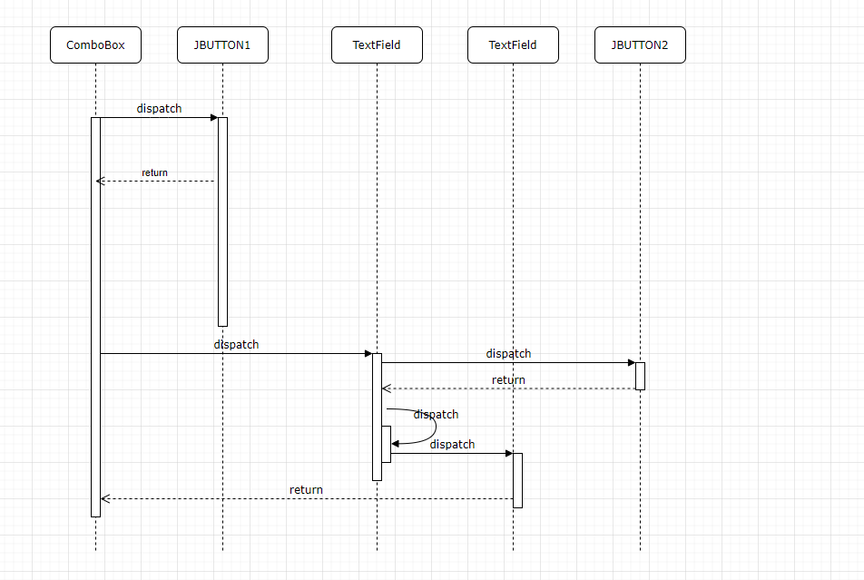

# IndividualProposal

Project Abstract

The Project basically just getting the components and software information of the system for the user. The main purpose for the software is to tell user which hardware they are using and the software they installed in their computer. It can also tell which version of the software they are using due to sometimes users need to know those information and don't know where to find it. 

Project Revevance
This program can be designed as Object Oriented Program that makes each object is easier to interact with one another because each object as instances of class. More or less, we can use Test Driven Development to test each classes are working properly. Also we can practice drawing the UML that can be drawn to explain the design of the program. Also, we can create a Graphical user interface, so it can be user friendly, plus we can connect it to database to display the spec of the hardware.

Conceptual Design
I will implement some functions for getting system info, such as not only the graphic card info, but like all the possible hardware that is built in the system. I would think look up the registry editor file to look for all the hardware is detected by the OS, and get the info and return it to the UI to user. I will implement some other functions also, like getting not only the software version but its driver version etc.

Background
URL：https://code.google.com/archive/p/whichwich/

Building
1.It working with either NetBeans 8.0.2 or higher version
2.Import the project in to the IDE, and click on Build

Running
1.Click on Run in NetBeans
2.The project is not done yet, only to get PC's Name is working

Required Resources
1.Group Members competencies
2.A device can compile Java source code
